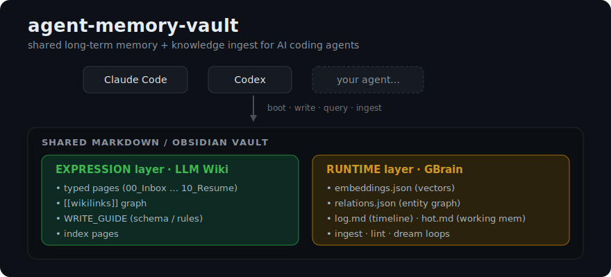

# agent-memory-vault

> **Stop letting your AI agents forget.** A shared, persistent memory + knowledge-ingest engine over a plain Markdown vault.

[](https://github.com/wuzishu3-web/agent-memory-vault/actions/workflows/ci.yml)
[](LICENSE)




**A persistent, shared long-term memory + knowledge-ingest system for AI coding agents** (Claude Code, Codex, and friends), built on a plain Markdown / [Obsidian](https://obsidian.md)-compatible vault.

Your agents stop forgetting. Instead of re-retrieving raw files on every query (classic RAG), they **compile knowledge into a maintained vault** of structured notes — and keep it cross-linked, deduplicated, and indexed automatically.

> Inspired by Andrej Karpathy's [LLM Wiki Pattern](https://gist.github.com/karpathy/442a6bf555914893e9891c11519de94f) (knowledge **expression** layer) and the GBrain idea of a continuously-running knowledge system (knowledge **runtime** layer). This project is both: a writable wiki of pages **plus** the engine that keeps it alive.

---

## The problem it solves

Most "give the AI a knowledge base" setups are just temporary retrieval: you dump PDFs/notes in, the system grabs a few chunks, the model stitches an answer — then it's gone. Ask twice, get two answers. New material doesn't reorganize old knowledge. Nothing accumulates.

`agent-memory-vault` flips it: knowledge is **written down once, as durable structured pages**, then maintained. The tedious part of a knowledge base isn't reading or thinking — it's the **bookkeeping** (cross-references, dedup, indexes, consistency). That's exactly what agents do reliably, so this system automates it.

## Key features

| Capability | Script | What it does |
|---|---|---|
| 🚀 **Boot context** | `agent_memory_boot.py` | One command prints the hot cache + recent log + task-relevant hits, so any agent starts a session already oriented. |
| ✍️ **Structured write** | `agent_memory.py` | Write a typed note (decision / knowledge / project / source / …) with frontmatter; auto-appends the log and the section index. |
| 🔥 **Hot cache** | `update_hot.py` | A ~500-word "where are we right now" snapshot every agent reads first. Overwrite-on-change, file-locked for concurrent agents. |
| 🔎 **Hybrid retrieval** | `query_vault.py` | Vector (cosine) + keyword search fused with RRF, plus a one-hop lookup over the relation graph. |
| 🧮 **Vector index** | `build_embeddings.py` | Incremental embeddings (content-hash based) via any OpenAI-compatible embedding endpoint. |
| 🕸️ **Relation graph** | `extract_relations.py` | Zero-LLM, regex + whitelist relation extraction (works_at / reports_to / founded / …). |
| ⭐ **Ingest pipeline** | `ingest.py` | Turn any external source (article / video / repo / transcript) into a page **+ bidirectional cross-references to the most similar existing notes + a quality gate + index rebuild**. The piece classic RAG and plain note-taking both skip. |
| 🛡️ **Auto-ingest hook** | `ingest_stop_hook.py` | A Claude Code Stop hook: if a session processed an external source but never ingested it, it reminds the agent (once) to file it — using the agent's own analysis, never a cheap auto-summary. |
| 🧹 **Lint** | `vault_health_check.py` | Finds stale inbox drafts, overdue `待核验` notes, orphan pages, incomplete frontmatter. |
| 🌙 **Consolidation** | `dream_cycle.py` | Periodic "dreaming" pass that reorganizes/promotes knowledge. |
| 📓 **Session beats** | `stop_hook_beat.py` | Conservative Stop hook that records what a session touched (redacts secrets). |

## The star: the ingest pipeline

```bash
python3 scripts/ingest.py --agent claude-code \
  --title "LLM Wiki Pattern vs GBrain" \
  --summary "<your high-quality summary, written by the agent>" \
  --body-file notes.md \
  --url "https://example.com/article" \
  --source-type article
```

What happens, deterministically:

1. **Dedup** — checks the source dir by URL / title; updates instead of duplicating.
2. **Quality gate** — if the summary/body is too thin, the source is **quarantined to the inbox** with `status: 待核验` and never pollutes your source folder. *No half-baked pages, ever.*
3. **Write page** — a structured `source` note with frontmatter, appended to the log and source index.
4. **Bidirectional cross-references** — embeds the new page, finds the top-K most semantically similar existing notes (cosine ≥ threshold), and writes `[[links]]` **both ways** — into the new page and back into each old page. This is the "bookkeeping" that keeps a wiki from rotting.
5. **Re-index** — incremental embeddings + relation extraction.

**Design principle: understanding vs bookkeeping are separated.** The *summary* must come from a capable agent in-context (high quality); the *script* only does the mechanical filing. That's why it can be fully automatic without producing junk.

## Demo

Ingesting a source automatically threads it into your existing knowledge:

```bash
$ python3 scripts/ingest.py --agent claude-code \
    --title "Hybrid Retrieval Explained" \
    --summary "Vector cosine + keyword via RRF, plus a relation-graph one-hop lookup." \
    --url "https://example.com/hybrid" --source-type article

# → writes  08_Sources/2026-…-Hybrid-Retrieval-Explained.md   (quality gate: passed)
# → finds the most similar existing note (cosine 0.752) and links it BOTH ways:
#     new page  ──▶  04_Knowledge/…-Vector-retrieval-deep-dive.md
#     that note ──▶  back to the new page          ← the bookkeeping a wiki usually rots without
# → rebuilds the embedding + relation indexes (incremental)
```

If the embedding endpoint is offline, the page is still written and logged — only
the cross-references and re-index are skipped (and the page is flagged for later).

## How it works (architecture)

```
        ┌─────────────────────────── your agents ───────────────────────────┐
        │   Claude Code        Codex          (your own agent)               │
        └───────────┬───────────────┬───────────────┬───────────────────────┘
                    │ boot / write / query / ingest  │
        ┌───────────▼────────────────────────────────▼───────────────────────┐
        │                      shared Markdown vault                          │
        │                                                                     │
        │  EXPRESSION layer (LLM Wiki)        RUNTIME layer (GBrain)           │
        │  • typed pages (00..10)             • embeddings.json (vectors)      │
        │  • [[wikilinks]] graph              • relations.json (entities)      │
        │  • WRITE_GUIDE (schema/rules)       • log.md (timeline)              │
        │  • index pages                      • hot.md (working memory)        │
        │                                     • ingest + lint + dream loops    │
        └─────────────────────────────────────────────────────────────────────┘
```

### Vault layout

```
your-vault/
├── index.md                      # home / catalog
├── AGENTS.md                     # operating rules agents read
├── 00_Inbox/                     # unsorted + quarantined drafts
├── 01_User/profile.md            # stable user preferences & background
├── 02_Agents/                    # one profile per agent
├── 03_Projects/  04_Knowledge/  05_Daily/
├── 06_Decisions/ 07_Playbooks/  08_Sources/   # ← ingest writes here
├── 09_Archive/   10_Resume/
└── _system/
    ├── WRITE_GUIDE.md            # the single authority: what goes where
    ├── AGENT_MEMORY_PROTOCOL.md  # the protocol all agents follow
    ├── hot.md  log.md            # working memory + timeline
    ├── embeddings.json relations.json   # generated indexes (gitignored)
    └── scripts/ → (this repo's scripts/)
```

## Install

```bash
git clone https://github.com/wuzishu3-web/agent-memory-vault.git
cd agent-memory-vault

# 1. Point an env var at where your vault will live (OUTSIDE this repo)
export AGENT_MEMORY_VAULT="$HOME/my-vault"

# 2. Scaffold a fresh vault from the template
python3 scripts/init_vault.py

# 3. Dependencies
pip install pyyaml          # required by extract_relations.py
# (embeddings/ingest also need an OpenAI-compatible embedding endpoint — see Config)
```

Add `export AGENT_MEMORY_VAULT=...` to your shell profile so every agent sees it.

### As a Claude Code skill

Symlink or copy this repo into your skills directory and the bundled `SKILL.md` makes it invocable:

```bash
ln -s "$(pwd)" ~/.claude/skills/agent-memory-vault
```

## Usage

```bash
# Start a session already oriented
python3 scripts/agent_memory_boot.py --agent claude-code --task "refactor the auth module"

# Write a durable note
python3 scripts/agent_memory.py --type decision --agent claude-code \
  --title "Why we switched to X" --summary "..." --body "..."

# Ingest an external source (see "the star" above)
python3 scripts/ingest.py --agent claude-code --title "..." --summary "..." --url "..." --source-type article

# Search
python3 scripts/query_vault.py "how did we handle rate limiting"

# Update the hot cache at the end of a session
python3 scripts/update_hot.py --agent claude-code --last "..." --active "..." --dont "..."

# Lint the vault
python3 scripts/vault_health_check.py
```

## Configuration

| Env var | Default | Purpose |
|---|---|---|
| `AGENT_MEMORY_VAULT` | `~/agent-memory-vault` | Path to your vault. |

Embedding endpoint (used by `build_embeddings.py`, `query_vault.py`, `ingest.py`) defaults to an OpenAI-compatible server at `http://127.0.0.1:1234/v1/embeddings` (e.g. [LM Studio](https://lmstudio.ai) running `text-embedding-nomic-embed-text-v1.5`). Override with `--url` / `--model`. **If the endpoint is down, ingest still writes pages — it just skips cross-references and re-indexing and marks the page for later indexing.** Vectors are never a hard dependency for capturing knowledge.

## Multi-agent setup

The whole point is that **several agents share one vault**. Each agent:
1. runs `agent_memory_boot.py --agent <name>` at the start,
2. writes durable facts via `agent_memory.py` / `ingest.py`,
3. overwrites `hot.md` via `update_hot.py` at the end.

`WRITE_GUIDE.md` is the single authority that maps *content → where it goes*, so three agents don't each invent their own filing scheme. Add new agents by dropping a profile in `02_Agents/` and a key in `AGENT_FILES` (in `agent_memory_boot.py` / `agent_memory.py`).

## 中文简介

给 AI 编程 agent（Claude Code、Codex…）用的**共享长期记忆 + 知识入库系统**，底座是纯 Markdown / Obsidian 笔记库。

不再是传统 RAG 的"临时检索"，而是把知识**编译成持续维护的结构化页面**，并自动完成最累的"记账"——交叉引用、去重、索引、一致性。核心亮点是 `ingest.py` **入库管道**：把任意外部源变成一篇页面，自动**双向连上语义最近的旧笔记** + **质量闸门**（不达标的隔离进 Inbox，正式区永不出半成品）+ 增量重建索引。理念是"理解归 agent、记账归脚本"，所以能全自动又不产生垃圾。灵感来自 Karpathy 的 LLM Wiki Pattern（知识表达层）与 GBrain（知识运行层），本项目把两层合一。

安装见上方 *Install*；用法见 *Usage*。

## Credits

- **Andrej Karpathy** — the [LLM Wiki Pattern](https://gist.github.com/karpathy/442a6bf555914893e9891c11519de94f) that frames the expression layer.
- **GBrain** — the framing of a continuously-running knowledge runtime.

## License

[MIT](LICENSE) © 2026 wuzishu3-web
